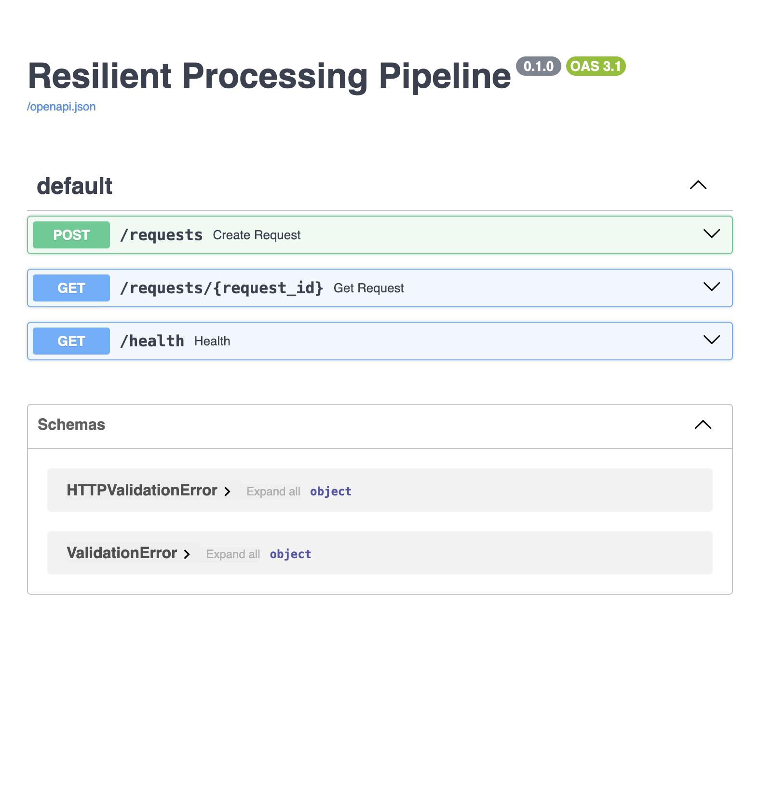
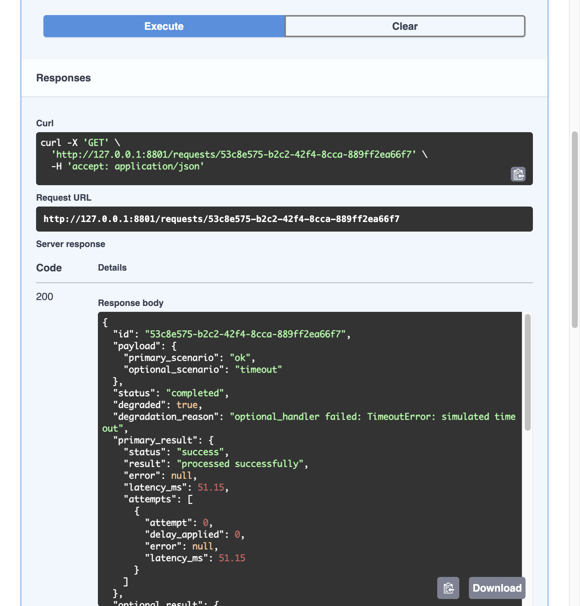
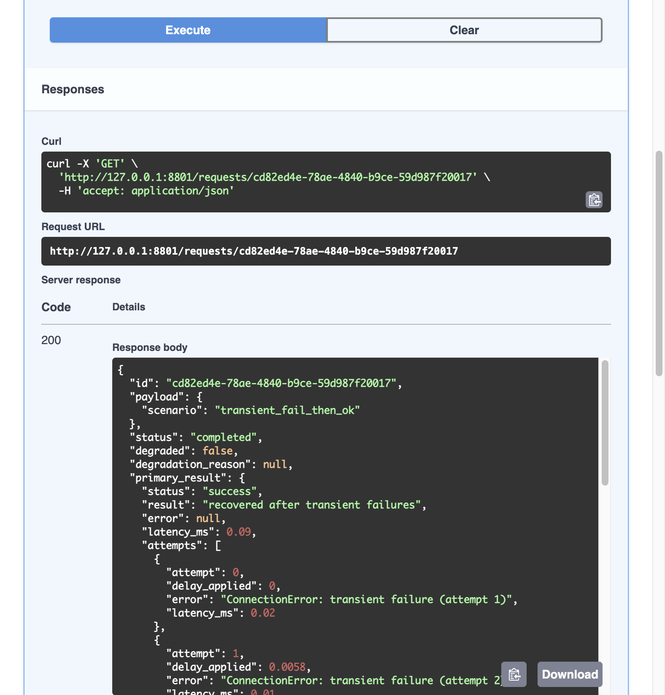
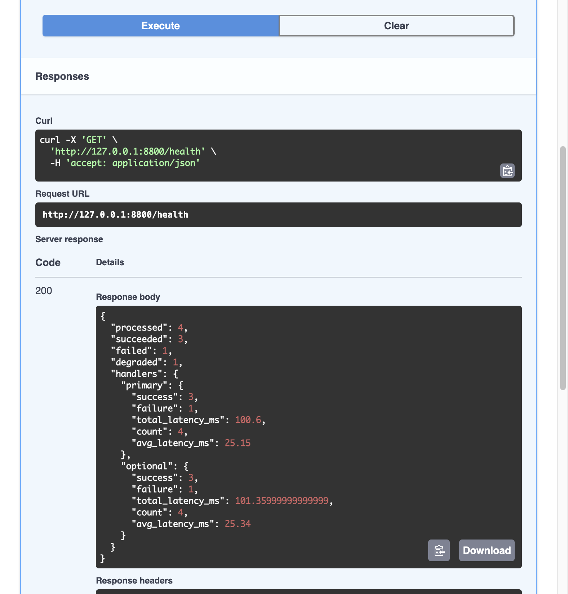

# Resilient Processing Pipeline

In-memory service that processes requests through two parallel handlers (`primary` + `optional`) with retry, backoff, and graceful degradation. If the primary handler fails, the request fails. If only the optional fails, the request completes in degraded mode.

## Project Structure

| File | What it does |
|------|-------------|
| [`app/models.py`](app/models.py) | Request lifecycle states, retry attempt records, handler results — all Pydantic models |
| [`app/retry.py`](app/retry.py) | `retry_with_backoff` — exponential backoff with full jitter, per-attempt timeout |
| [`app/handlers.py`](app/handlers.py) | `primary_handler` / `optional_handler` with deterministic scenario dispatch |
| [`app/metrics.py`](app/metrics.py) | In-memory counters, per-handler latency tracking, `snapshot()` for the health endpoint |
| [`app/main.py`](app/main.py) | FastAPI app — endpoints, orchestration via `asyncio.gather`, state management |
| [`tests/test_api.py`](tests/test_api.py) | Integration tests — 6 scenarios through the HTTP API |
| [`NOTES.md`](NOTES.md) | Design decisions and tradeoffs |

## Setup

```bash
python3 -m venv .venv
source .venv/bin/activate
pip install -r requirements.txt
```

## Run

```bash
uvicorn app.main:app --reload
```

## Test

```bash
pytest -v
```

```
tests/test_api.py::test_both_handlers_ok_returns_completed PASSED        [ 16%]
tests/test_api.py::test_optional_timeout_returns_degraded PASSED         [ 33%]
tests/test_api.py::test_primary_hard_fail_fails_request PASSED           [ 50%]
tests/test_api.py::test_transient_failure_retries_then_succeeds PASSED   [ 66%]
tests/test_api.py::test_health_reflects_processed_requests PASSED        [ 83%]
tests/test_api.py::test_get_unknown_request_returns_404 PASSED           [100%]

6 passed in 2.86s
```

## API

| Method | Endpoint | Description |
|--------|----------|-------------|
| `POST` | `/requests` | Submit a request. Returns 202 with `request_id`. |
| `GET` | `/requests/{request_id}` | Poll status, results, retry history. |
| `GET` | `/health` | Counters and latency per handler. |

## Scenarios

Control handler behavior via `payload`:

| Scenario | Behavior |
|----------|----------|
| `ok` | Succeeds |
| `timeout` | `TimeoutError` — retryable |
| `transient_fail_then_ok` | `ConnectionError` twice, then succeeds |
| `hard_fail` | `ValueError` — non-retryable, fails immediately |

`scenario` applies to both handlers. Use `primary_scenario` / `optional_scenario` to test mixed behavior (e.g., primary OK + optional timeout for degraded mode).

---

## Walkthrough — Local Verification

All output below was captured from a local run against `http://127.0.0.1:8800`.

### Swagger UI

Three endpoints, auto-generated from FastAPI route definitions in [`app/main.py`](app/main.py):



### 1. Service starts clean

Health endpoint confirms zero state. No requests processed yet, all counters at zero. Metrics are tracked in [`app/metrics.py`](app/metrics.py).

```bash
$ curl -s http://127.0.0.1:8800/health
```

```json
{
    "processed": 0,
    "succeeded": 0,
    "failed": 0,
    "degraded": 0,
    "handlers": {
        "primary": {
            "success": 0,
            "failure": 0,
            "total_latency_ms": 0.0,
            "count": 0,
            "avg_latency_ms": 0
        },
        "optional": {
            "success": 0,
            "failure": 0,
            "total_latency_ms": 0.0,
            "count": 0,
            "avg_latency_ms": 0
        }
    }
}
```

### 2. Happy path — both handlers succeed

<!-- VIDEO NOTE: "Both handlers run in parallel via asyncio.gather. Single attempt each, no errors, no degradation." -->

POST returns 202 with a `request_id` and `pending` status. Processing happens in the background via [`process_request`](app/main.py) which runs both handlers as concurrent tasks through `asyncio.gather`.

```bash
$ curl -s -X POST http://127.0.0.1:8800/requests \
  -H "Content-Type: application/json" \
  -d '{"scenario": "ok"}'
```

```json
{
    "request_id": "7f831417-03f4-4f35-a36b-720f4cde0db3",
    "status": "pending"
}
```

Poll the request. Both handlers completed in ~50ms. One attempt each, no errors.

```bash
$ curl -s http://127.0.0.1:8800/requests/7f831417-03f4-4f35-a36b-720f4cde0db3
```

```json
{
    "id": "7f831417-03f4-4f35-a36b-720f4cde0db3",
    "payload": { "scenario": "ok" },
    "status": "completed",
    "degraded": false,
    "degradation_reason": null,
    "primary_result": {
        "status": "success",
        "result": "processed successfully",
        "error": null,
        "latency_ms": 50.0,
        "attempts": [
            { "attempt": 0, "delay_applied": 0.0, "error": null, "latency_ms": 50.0 }
        ]
    },
    "optional_result": {
        "status": "success",
        "result": "processed successfully",
        "error": null,
        "latency_ms": 50.06,
        "attempts": [
            { "attempt": 0, "delay_applied": 0.0, "error": null, "latency_ms": 50.06 }
        ]
    },
    "created_at": "2026-03-26T02:29:30.576862Z",
    "started_at": "2026-03-26T02:29:30.577082Z",
    "finished_at": "2026-03-26T02:29:30.627276Z"
}
```

**What to check**: `status: completed`, `degraded: false`, both results show `success` with a single attempt.

### 3. Degraded mode — primary OK, optional times out

<!-- VIDEO NOTE: "This is the core of the exercise. The primary handler succeeds. The optional handler times out on every retry. The request still completes — but in degraded mode with a reason attached." -->

Send the primary down the happy path, force the optional to time out. Per-handler scenario overrides are resolved in [`app/handlers.py`](app/handlers.py). The retry loop with backoff and jitter lives in [`app/retry.py`](app/retry.py).

```bash
$ curl -s -X POST http://127.0.0.1:8800/requests \
  -H "Content-Type: application/json" \
  -d '{"primary_scenario": "ok", "optional_scenario": "timeout"}'
```

```json
{
    "request_id": "d4ebf0d5-b749-4132-bcb5-a9a0d8dc8809",
    "status": "pending"
}
```

Poll after the retry loop completes. The optional handler tried 4 times (attempt 0 through 3), failed every time with `TimeoutError`, and you can see the backoff delays increasing: `0.0 → 0.12 → 0.30 → 0.47`.

```bash
$ curl -s http://127.0.0.1:8800/requests/d4ebf0d5-b749-4132-bcb5-a9a0d8dc8809
```

```json
{
    "id": "d4ebf0d5-b749-4132-bcb5-a9a0d8dc8809",
    "payload": {
        "primary_scenario": "ok",
        "optional_scenario": "timeout"
    },
    "status": "completed",
    "degraded": true,
    "degradation_reason": "optional_handler failed: TimeoutError: simulated timeout",
    "primary_result": {
        "status": "success",
        "result": "processed successfully",
        "error": null,
        "latency_ms": 51.25,
        "attempts": [
            { "attempt": 0, "delay_applied": 0.0, "error": null, "latency_ms": 51.25 }
        ]
    },
    "optional_result": {
        "status": "error",
        "result": null,
        "error": "TimeoutError: simulated timeout",
        "latency_ms": 0.19,
        "attempts": [
            { "attempt": 0, "delay_applied": 0.0, "error": "TimeoutError: simulated timeout", "latency_ms": 0.02 },
            { "attempt": 1, "delay_applied": 0.1161, "error": "TimeoutError: simulated timeout", "latency_ms": 0.03 },
            { "attempt": 2, "delay_applied": 0.3007, "error": "TimeoutError: simulated timeout", "latency_ms": 0.07 },
            { "attempt": 3, "delay_applied": 0.4662, "error": "TimeoutError: simulated timeout", "latency_ms": 0.07 }
        ]
    },
    "created_at": "2026-03-26T02:29:31.700496Z",
    "started_at": "2026-03-26T02:29:31.700775Z",
    "finished_at": "2026-03-26T02:29:32.585933Z"
}
```

**What to check**: `status: completed` (not failed), `degraded: true`, `degradation_reason` explains what went wrong, primary still succeeded, optional shows all 4 retry attempts with increasing jittered delays. The degradation logic is the three-branch check in [`process_request`](app/main.py).

Swagger UI showing the same degraded response — `"degraded": true`, `"degradation_reason"` visible, primary succeeded:



### 4. Primary failure — request fails regardless

<!-- VIDEO NOTE: "When the primary handler fails with a non-retryable error, the request fails immediately. One attempt, no retry — because a ValueError won't resolve by trying again. The optional handler still ran and succeeded, but it doesn't matter. Primary is required." -->

```bash
$ curl -s -X POST http://127.0.0.1:8800/requests \
  -H "Content-Type: application/json" \
  -d '{"primary_scenario": "hard_fail", "optional_scenario": "ok"}'
```

```json
{
    "request_id": "e9ab4832-4a07-48f7-b7f5-e15c1e917d85",
    "status": "pending"
}
```

```bash
$ curl -s http://127.0.0.1:8800/requests/e9ab4832-4a07-48f7-b7f5-e15c1e917d85
```

```json
{
    "id": "e9ab4832-4a07-48f7-b7f5-e15c1e917d85",
    "payload": {
        "primary_scenario": "hard_fail",
        "optional_scenario": "ok"
    },
    "status": "failed",
    "degraded": false,
    "degradation_reason": null,
    "primary_result": {
        "status": "error",
        "result": null,
        "error": "ValueError: permanent failure — non-retryable",
        "latency_ms": 0.01,
        "attempts": [
            { "attempt": 0, "delay_applied": 0.0, "error": "ValueError: permanent failure — non-retryable", "latency_ms": 0.01 }
        ]
    },
    "optional_result": {
        "status": "success",
        "result": "processed successfully",
        "error": null,
        "latency_ms": 50.9,
        "attempts": [
            { "attempt": 0, "delay_applied": 0.0, "error": null, "latency_ms": 50.9 }
        ]
    },
    "created_at": "2026-03-26T02:29:53.940741Z",
    "started_at": "2026-03-26T02:29:53.941304Z",
    "finished_at": "2026-03-26T02:29:53.992388Z"
}
```

**What to check**: `status: failed`, primary has exactly 1 attempt (no retry for `ValueError`), optional succeeded but doesn't save the request. The retry whitelist (`TimeoutError`, `ConnectionError`, `ConnectionRefusedError`) is defined in [`app/retry.py`](app/retry.py) — `ValueError` is not on it.

Swagger UI showing `"status": "failed"` with the `ValueError` — single attempt, no retry:


### 5. Transient failure — retries with backoff then recovers

<!-- VIDEO NOTE: "Both handlers fail twice with ConnectionError, then succeed on the third attempt. You can see the backoff delays growing — attempt 0 has zero delay, attempt 1 has a small jittered delay, attempt 2 has a larger one. Each handler gets independent jitter, so their delays are different. That's the decorrelation working." -->

```bash
$ curl -s -X POST http://127.0.0.1:8800/requests \
  -H "Content-Type: application/json" \
  -d '{"scenario": "transient_fail_then_ok"}'
```

```json
{
    "request_id": "5f3c8cdd-bdef-4024-a1f5-7a8822104bee",
    "status": "pending"
}
```

```bash
$ curl -s http://127.0.0.1:8800/requests/5f3c8cdd-bdef-4024-a1f5-7a8822104bee
```

```json
{
    "id": "5f3c8cdd-bdef-4024-a1f5-7a8822104bee",
    "payload": { "scenario": "transient_fail_then_ok" },
    "status": "completed",
    "degraded": false,
    "degradation_reason": null,
    "primary_result": {
        "status": "success",
        "result": "recovered after transient failures",
        "error": null,
        "latency_ms": 0.08,
        "attempts": [
            { "attempt": 0, "delay_applied": 0.0, "error": "ConnectionError: transient failure (attempt 1)", "latency_ms": 0.02 },
            { "attempt": 1, "delay_applied": 0.0877, "error": "ConnectionError: transient failure (attempt 2)", "latency_ms": 0.03 },
            { "attempt": 2, "delay_applied": 0.4753, "error": null, "latency_ms": 0.03 }
        ]
    },
    "optional_result": {
        "status": "success",
        "result": "recovered after transient failures",
        "error": null,
        "latency_ms": 0.1,
        "attempts": [
            { "attempt": 0, "delay_applied": 0.0, "error": "ConnectionError: transient failure (attempt 1)", "latency_ms": 0.01 },
            { "attempt": 1, "delay_applied": 0.0342, "error": "ConnectionError: transient failure (attempt 2)", "latency_ms": 0.04 },
            { "attempt": 2, "delay_applied": 0.1378, "error": null, "latency_ms": 0.05 }
        ]
    },
    "created_at": "2026-03-26T02:29:56.056763Z",
    "started_at": "2026-03-26T02:29:56.056963Z",
    "finished_at": "2026-03-26T02:29:56.621593Z"
}
```

**What to check**: 3 attempts per handler. First two have `ConnectionError`, third succeeds. `delay_applied` grows with each attempt (exponential backoff). Primary and optional have *different* jitter values (decorrelated). Final status is `completed`, not degraded — both recovered.

Swagger UI showing the retry attempts with `ConnectionError` errors and increasing `delay_applied` values:



### 6. Health endpoint — aggregate metrics after all scenarios

<!-- VIDEO NOTE: "After running all four scenarios: 4 processed, 3 succeeded, 1 failed, 1 degraded. Per-handler counters match. Average latency is computed at read time." -->

Swagger UI executing `GET /health` with the live response after all four scenarios:



Same data via curl:

```bash
$ curl -s http://127.0.0.1:8800/health
```

```json
{
    "processed": 4,
    "succeeded": 3,
    "failed": 1,
    "degraded": 1,
    "handlers": {
        "primary": {
            "success": 3,
            "failure": 1,
            "total_latency_ms": 101.34,
            "count": 4,
            "avg_latency_ms": 25.34
        },
        "optional": {
            "success": 3,
            "failure": 1,
            "total_latency_ms": 101.25,
            "count": 4,
            "avg_latency_ms": 25.31
        }
    }
}
```

**What to check**: `processed: 4` matches the four requests above. `succeeded: 3` (scenarios 1, 2, 4). `failed: 1` (scenario 3). `degraded: 1` (scenario 2). Per-handler success/failure counts are consistent. Counters are updated by [`metrics.record()`](app/metrics.py), averages computed at read time by [`metrics.snapshot()`](app/metrics.py).

---

## Video Walkthrough

<!-- TODO: Add Loom link -->
